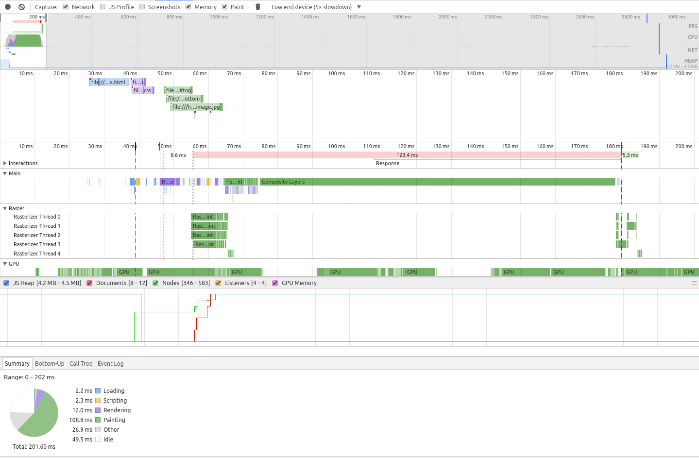

# SVG Mask

## ✖ Simple CSS

```css
:root {
  --width: 100%;
  --height: 100px;
  --top-color: #f44336;
  --bottom-color: #2196F3;
}

.separator {
  position: relative;
  width: var(--width);
  height: var(--height);
}

.separator::before {
  position: absolute;
  content: '';
  display: block;
  width: 100%;
  height: 100%;
  background-color: var(--top-color);
  mask-image: url(diagonal.svg#top);
  mask-size: cover;
}

.separator::after {
  position: absolute;
  content: '';
  display: block;
  width: 100%;
  height: 100%;
  background-color: var(--bottom-color);
  mask-image: url(diagonal.svg#bottom);
  mask-size: cover;
}
```

###### Reversed

```css
.separator.reverse::before {
  mask-image: url(diagonal.svg#top-reverse);
}

.separator.reverse::after {
  mask-image: url(diagonal.svg#bottom-reverse);
}
```

**Notes:**

- 👎 Requires the use of vendor prefix
- 👎 Requires the use of generated content
- 👍 The angle is controlled by the element height value
- 👍 The svg image can either be an external file or embedded as a Data URI for a pure CSS approach
- 👍 Full control of element & SVG shape
  - example: creating a shadow effect in SVG
  - _see [`shadow.svg`](shadow.svg) for an example_

## ✖ Generated Content

**Cannot** be used with the `::before` and `::after` pseudo-elements as it relies on them already to generate the HTML content for the separator.

## ✖ Cross Browser Support

[Partial support](http://caniuse.com/#feat=css-masks)

**Note**:
- The example in above uses SVG Fragments to display two colors in the separator
  - consult the [browser support matrix](http://caniuse.com/#feat=svg-fragment) before using.
  - alternatively, you can just use one triangle svg and manualy control the position of the transparent separator

## ✖ Performance



## Demo

View [Demo][demo], Play on [CodePen][pen], or inspect the [source files](index.html).

[demo]: https://raw.githack.com/ahmadnassri/css-diagonal-separators/master/svg-mask/index.html
[pen]: http://codepen.io/ahmadnassri/pen/LbKreW
