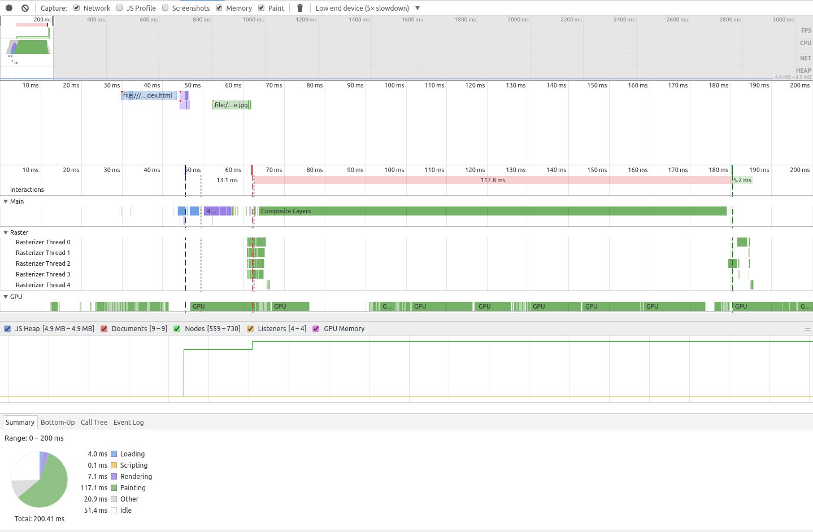

# CSS3 2D Transforms

## ✖ Simple CSS

```css
:root {
  --width: 300px;
  --height: 100px;
  --top-color: #f44336;
  --bottom-color: #2196F3;
  --vertical-angel: 108.5deg;
  --horizontal-angel: 18.5deg;
}

.separator {
  width: var(--width);
  height: var(--height);
  overflow: hidden;
}

.separator::before {
  display: block;
  content: '';
  width: 100%;
  height: 100%;
  background-color: var(--top-color);
  transform: skewY(calc(-1 * var(--horizontal-angel)));
  transform-origin: bottom left;
}

.separator::after {
  display: block;
  content: '';
  width: 100%;
  height: 100%;
  background-color: var(--bottom-color);
  transform: skewY(calc(-1 * var(--horizontal-angel)));
  transform-origin: bottom left;
}
```

###### Reversed

```css
.separator.reverse::before,
.separator.reverse::after {
  transform: skewY(var(--horizontal-angel));
  transform-origin: bottom right;
}
```

###### Vertical

```css
.separator.vertical::before,
.separator.vertical::after {
  transform: skewY(var(--vertical-angel));
}
```

###### Reversed Vertical

```css
.separator.vertical.reverse {
  position: relative;
}

.separator.vertical.reverse::before {
  position: absolute;
  transform: skewY(calc(-1 * var(--vertical-angel)));
  transform-origin: bottom left;
}

.separator.vertical.reverse::after {
  position: absolute;
  transform: skewY(calc(-1 * var(--vertical-angel)));
  transform-origin: top right;
}
```

- 👎 Must calculate desired angle manually
- 👎 Must set corrosponding element height value manually
- 👎 Requires the use of generated content
- 👎 Further control is limited
  - example: creating a shadow effect using `box-shadow`
- 👋 The example above uses [CSS Variables][css-vars] for demonstration purposes, adjust for your own use
  - _css variables are [not fully supported yet][css-vars-compat]._
- 👋 `reversed` & `vertical` variants listed above are verbose for demonstration purposes
  - for simple multi directional classes, use the [`rotate()`][css-transform-rotate] function as needed
  - _see [`style.css`](style.css) for an example_
- 👌 Use with `transparent` colors _(e.g. to overlay an image, or content)_ will require `absolute` or manual positioning:
  - _see [`layout.css`](../layout.css) for an example_

## ✖ Generated Content

**Cannot** be used with the `::before` and `::after` pseudo-elements as it relies on them already to generate the HTML content for the separator.

## ✖ Cross Browser Support

[Partial support](http://caniuse.com/#feat=transforms2d)

> Supported in all major browsers, with the exception of `Opera Mini`.

## ✖ Performance



## Demo

View [Demo][demo], Play on [CodePen][pen], or inspect the [source files](index.html).

[demo]: https://raw.githack.com/ahmadnassri/css-diagonal-separators/master/transforms/index.html
[css-vars]: https://developer.mozilla.org/en-US/docs/Web/CSS/Using_CSS_variables
[css-vars-compat]: http://caniuse.com/#search=variables
[css-transform-rotate]: https://www.w3.org/TR/css-transforms-1/#funcdef-rotate
[pen]: http://codepen.io/ahmadnassri/pen/pNmqZQ
